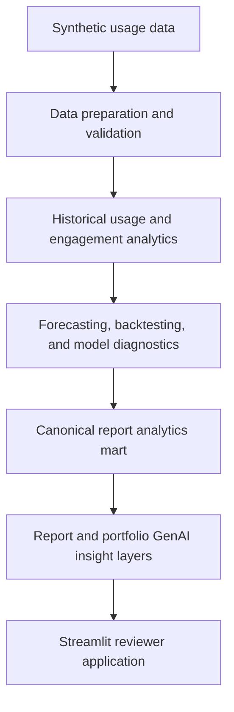

# Power BI Usage Intelligence

**Forecasting, engagement analytics, model diagnostics, and governed GenAI insights for report-usage monitoring.**

---

## Overview

This project demonstrates an end-to-end analytics workflow for monitoring Power BI report usage. It uses synthetic report-usage telemetry to identify trends, forecast demand 28 days ahead, evaluate model reliability, and measure user engagement — all while preserving privacy. Report-level and portfolio-level insights are generated offline by a governed GenAI layer and presented through a Streamlit reviewer application.

The project is designed as a portfolio-friendly version of a realistic analytics problem. It demonstrates production-oriented design decisions — privacy suppression, evidence gating, deterministic decision logic, structured GenAI output, and offline insight generation — without exposing real organisational data.

---

## Business Problem

Analytics and reporting teams often need to understand more than which reports exist. Specifically:

- Which reports are gaining or losing demand, and at what rate?
- Which reports have sustained or weakening user engagement?
- Which forecasts can be interpreted reliably, and where is the model evidence thin?
- Which reports require active review, and why?
- When evidence is weak, does the problem lie with the report or with the model?
- How can technical analytical outputs be communicated clearly to non-technical stakeholders?

This project builds an analytical framework that addresses each of these questions with verifiable, privacy-safe outputs.

---

## Key Capabilities

- **Synthetic telemetry and semantic modelling** — generates realistic report-usage data and structures it into a clean analytical model.
- **Complete daily time-series construction** — fills activity gaps, separates no-view days from no-data days, and applies data-sufficiency gates before any model is fitted.
- **Per-report forecasting with rolling-origin backtesting** — evaluates candidate models across multiple walk-forward folds, selects the best fit per report, and produces 28-day prediction intervals.
- **Model diagnostics and evidence maturity tracking** — monitors bias, residual autocorrelation, and interval calibration; distinguishes insufficient evidence from poor performance.
- **Privacy-safe engagement analytics** — measures unique users, returning usage, lapse cohorts, activity frequency, and concentration; suppresses small-group metrics before output.
- **Canonical report analytics mart** — joins historical usage, forecast outlook, model health, engagement context, metadata, and diagnostics into one decision-support table per report.
- **Report-level and portfolio-level GenAI insights** — generates structured, grounded summaries offline using validated analytical outputs as the sole evidence base; no live LLM calls at display time.
- **Streamlit portfolio and report explorer** — presents persisted outputs through an interactive application with search, filters, a deterministic attention shortlist, and per-report drill-down.

---

## Architecture



**Design principles:**

- Deterministic analytics calculate metrics, statuses, and recommended actions.
- GenAI explains validated evidence — it does not recalculate it.
- Streamlit presents persisted outputs and does not recreate upstream decision logic.
- No live LLM calls occur during page rendering.

> The analytics layer calculates and decides; the GenAI layer explains.

---

## How the Solution Supports Decisions

| Analytical signal | Example interpretation | Possible stakeholder response |
|---|---|---|
| Declining usage status | Views have fallen consistently over 28 days | Investigate whether the report is still needed or being accessed through another route |
| Elevated lapse rate | A high share of prior users have not returned | Review whether recent changes or communications affected access |
| Forecast decline | Model predicts continued reduction over 28 days | Assess whether usage decline reflects shifting priorities |
| High forecast uncertainty | Wide prediction interval; volatile historical pattern | Treat the forecast directionally rather than as a point estimate |
| Insufficient model-health evidence | Fewer than three valid backtest folds completed | Treat the model as unvalidated rather than as performing poorly |
| Missing metadata | Workspace, category, or launch date absent | Complete report inventory before acting on segmentation outputs |
| Privacy-suppressed engagement | Fewer than five unique users in the window | No engagement details are available; suppressed values are not zero |

Recommendations are for human review. No report is automatically retired, deleted, or reassigned.

---

## Methodology

### Forecasting

Each report receives its own model fitted to a clean, zero-filled daily-views series. Candidate models — including seasonal and non-seasonal ARIMA variants — are evaluated across rolling-origin backtest folds. The best-performing model per report is selected based on accuracy metrics including WAPE and MAPE. Forecasts cover a 28-day horizon and include prediction intervals. Data-sufficiency gates prevent modelling reports with inadequate history.

### Engagement Analytics

Engagement is measured at the report level using privacy-safe aggregates: unique users, returning users, lapse cohorts, activity frequency, and concentration (Herfindahl-Hirschman Index). Metrics for groups smaller than a configurable minimum are suppressed before output. Suppressed values are never treated as zero. Low engagement does not imply low business value; the analytics distinguish engagement patterns from usage volume.

### Model Diagnostics

The diagnostics layer monitors bias stability, residual autocorrelation, interval calibration, and evidence maturity across the per-report model population. Evidence maturity tracks how many valid backtest folds exist. **Insufficient evidence is a measurement-maturity signal, not a sign of a poorly performing model.** Reports with insufficient backtest history receive a distinct status rather than an unhealthy rating.

### GenAI Insight Layer

The validated canonical analytics mart (`mart_report_analytics.csv`) is the sole input to the GenAI layer. Report-level and portfolio-level contexts are constructed from privacy-safe aggregates before any prompt is sent. Outputs are structured JSON, persisted offline, and validated before use. Validation checks groundedness against the input evidence, directional consistency, numerical plausibility, safety, and evidence-limitation disclosures. When generation fails validation or no API key is present, a deterministic rule-based fallback is used. Input hashing avoids regenerating unchanged insights. The Streamlit application reads persisted insight files and makes no live LLM calls.

---

## Streamlit Application

```bash
streamlit run src/app/streamlit_app.py
```

The application has two tabs:

**Portfolio Overview** — headline metrics (total reports, recent usage, requiring review, high priority, privacy-suppressed), portfolio-level GenAI summary, deterministic attention shortlist (reports with high priority or non-standard recommended action), and status distributions across usage, forecast outlook, engagement, model health, and review priority.

**Report Explorer** — per-report drill-down with search and multi-field filters. Each report view shows: summary header, deterministic review action, AI-generated summary, historical usage chart, forecast and prediction-interval chart, model-health evidence, engagement metrics (with suppression indicators), diagnostics and evidence quality, and lineage metadata in an expander.

Both tabs are populated entirely from pre-generated analytical outputs. The application does not recalculate any analytical metric, call any external API, or execute any pipeline logic at render time.

---

## Repository Structure

```text
data/          Raw synthetic telemetry (raw/) and processed semantic model (processed/)
docs/          Methodology references, data dictionaries, privacy policy, architecture notes
notebooks/     Ten ordered notebooks providing an auditable analytical walkthrough
outputs/       Generated artifacts (analytics marts, forecasts, insights, diagnostics)
src/           Python source — analytics, features, models, GenAI, pipelines, Streamlit app
tests/         Automated test suite covering all major analytical and application components
```

---

## Notebook Walkthrough

The notebooks provide an auditable and exploratory walkthrough of the analytical pipeline. Each notebook exercises the same reusable components used by the Python pipeline scripts. Running notebooks in order is one way to reproduce the full output set; the pipeline scripts provide an equivalent command-line path.

| Notebook | Purpose | Main output | Role |
|---|---|---|---|
| `01_generate_raw_tables.ipynb` | Generates synthetic report-usage telemetry with trends, seasonality, and noise | `data/raw/*.csv` | Required walkthrough |
| `02_build_semantic_model_csv.ipynb` | Builds clean dimension and fact tables from raw telemetry | `data/processed/*.csv` | Required walkthrough |
| `03_validate_semantic_model_hybrid_gx_csv.ipynb` | Validates semantic model completeness, uniqueness, and referential integrity | `outputs/validation/` | Validation |
| `04_feature_engineering.ipynb` | Constructs the canonical daily-views series, the diagnostic context mart, and supporting feature marts | `data/processed/mart_report_daily_series.csv`, `mart_report_daily_context.csv` | Required walkthrough |
| `05_forecasting_baseline.ipynb` | Runs rolling-origin backtesting across candidate models and selects the best model per report | `outputs/forecasts/`, `outputs/metrics/` | Required walkthrough |
| `06_model_diagnostics.ipynb` | Explores bias stability, residual autocorrelation, interval calibration, and the consolidated model-health summary | `outputs/diagnostics/` | Exploratory |
| `07_report_analytics.ipynb` | Builds report-level behavioural analytics, segmentation, and diagnostics from the processed series | `outputs/segments/`, `outputs/diagnostics/` | Exploratory |
| `08_user_analytics.ipynb` | Builds user engagement features including lapse cohorts, return rates, and concentration metrics | `outputs/metrics/`, `outputs/segments/` | Exploratory |
| `09_report_analytics.ipynb` | Assembles the canonical decision-support mart by joining all analytical layers into one report per row | `outputs/analytics/mart_report_analytics.csv` | Required walkthrough |
| `10_genai_insights.ipynb` | Demonstrates the GenAI insight generation pipeline, validation checks, hash-reuse logic, and evaluation | `outputs/insights/`, `outputs/evaluation/` | Demonstration |

---

## Getting Started

### Requirements

- **Python 3.10 or 3.11 recommended** (Python 3.9 minimum; Python 3.12 is compatible).
- No package installation beyond `pip install -r requirements.txt`.

```bash
python -m venv .venv
source .venv/bin/activate       # macOS / Linux
# .venv\Scripts\activate        # Windows

pip install -r requirements.txt
```

All 134 packages are pinned to exact versions for reproducible installation.

### Optional GenAI configuration

Copy the environment template and set your API key if you want live LLM generation:

```bash
cp .env.example .env
# Edit .env and set: OPENAI_API_KEY=sk-...
```

The API key is not required to run the application, run the tests, or use the rule-based fallback. Real credentials must never be committed to the repository.

### Run the pipeline

Synthetic data generation still requires the first four notebooks to be run in order, as the data generation scripts depend on notebook-specific parameter choices. After that, the analytical pipeline can be run from the command line:

```bash
# Generate synthetic data (run notebooks 01–04 first, or use scripts below)
python src/data/generate_synthetic_data.py
python src/data/build_semantic_model.py
python src/data/validate_model.py
python -m src.features.build_forecast_features     # if available, else run notebook 04

# Forecasting and analytics
python -m src.pipelines.run_forecasting_pipeline
python -m src.pipelines.run_report_analytics_pipeline
python -m src.pipelines.run_user_analytics_pipeline
python -m src.pipelines.run_analytics_mart_pipeline

# GenAI insights (requires OPENAI_API_KEY, or uses rule-based fallback)
python -m src.genai.insight_generator
python -m src.genai.portfolio_insights
```

Each pipeline script writes its outputs to the appropriate `outputs/` subdirectory.

### Launch Streamlit

After generating the analytics outputs:

```bash
streamlit run src/app/streamlit_app.py
```

The application reads pre-generated files from `outputs/analytics/`, `outputs/forecasts/`, and `outputs/insights/`.

### Run tests

```bash
pytest
```

The test suite covers data preparation, forecasting, model diagnostics, engagement analytics, GenAI validation, Streamlit helpers, and integration flows. Tests do not make live LLM API calls. A small number of tests are skipped in environments without an API key; all others pass.

---

## Main Outputs

| Artifact | Path | Grain | Purpose |
|---|---|---|---|
| Canonical analytics mart | `outputs/analytics/mart_report_analytics.csv` | One row per report | Primary input to GenAI and Streamlit |
| Engagement mart | `outputs/analytics/mart_report_engagement.csv` | One row per report | Privacy-safe engagement status per report |
| Daily user mart | `outputs/analytics/mart_report_user_daily.csv` | One row per report-date | Source for engagement analytics |
| Latest forecast | `outputs/forecasts/report_view_forecasts_latest.csv` | One row per report-date in horizon | 28-day ahead forecasts with prediction intervals |
| Report AI insights | `outputs/insights/report_ai_insights.json` | One record per report | Structured GenAI summaries, validation status, and fallback state |
| Portfolio AI insight | `outputs/insights/portfolio_ai_insight.json` | Portfolio level | GenAI management summary across all reports |
| GenAI evaluation summary | `outputs/evaluation/genai_evaluation_summary.json` | Evaluation run | Precision, coverage, and failure-mode counts across evaluation cases |

---

## Data and Privacy

- All data in this repository is **synthetic**. No real organisational Power BI telemetry is included.
- User-level identifiers are excluded from all GenAI input contexts and are not displayed in the Streamlit application.
- Engagement metrics for groups below a configurable minimum unique-user threshold are suppressed before output. Suppressed values are never treated as zero or imputed.
- Concentration metrics (Herfindahl-Hirschman Index, top-user view shares) measure usage dependency, not misuse. High concentration is not interpreted as a policy violation.
- Review recommendations are advisory outputs for human consideration. No business action — retirement, access change, automated retraining — is executed by this system.

---

## Generated Artifact Policy

Generated analytics outputs are reproducible pipeline artifacts and are excluded from the repository.

| Committed to repository | Regenerated and excluded |
|---|---|
| Source code (`src/`) | Raw synthetic data (`data/raw/`) |
| Notebooks (`notebooks/`) | Processed datasets (`data/processed/`) |
| Tests (`tests/`) | Analytics mart CSVs (`outputs/analytics/`) |
| Test fixtures (`tests/fixtures/`) | Forecast outputs (`outputs/forecasts/`) |
| Sample forecast reference (`outputs/forecasts/sample_baseline_forecasts.csv`) | Generated GenAI insight JSON files |
| Public documentation (`docs/*.md`) | GenAI evaluation run outputs |
| Environment template (`.env.example`) | Local caches, build artefacts, private preparation documents |

All excluded artifacts can be recreated by following the pipeline workflow described above.

---

## Limitations

- **Synthetic source data.** All 30 reports and their usage patterns are programmatically generated. The methodology is realistic, but the outputs are not grounded in real Power BI telemetry.
- **Limited production forecast history.** The model-health evidence layer requires accumulated production forecast comparisons. With synthetic data over a short window, most reports receive an `insufficient_evidence` model-health status — which is expected and correctly labelled as evidence maturity.
- **GenAI quality varies.** Output quality depends on the model version, prompt, and context length. The validation layer catches common failure modes but is not exhaustive.
- **No live enterprise integration.** The project demonstrates production-oriented patterns but does not connect to a live Power BI API, data warehouse, or organisational access-control system.
- **Stakeholder usefulness testing not completed.** The Streamlit application has not been evaluated with real analytics or reporting stakeholders.
- **Notebook data-generation step.** Fully automated one-command reproducibility from an empty state is not yet available; notebooks 01–04 provide the synthetic data generation step.

---

## Tests

The test suite covers:

- **Data preparation** — series construction, zero-fill logic, active-period detection, data-sufficiency validation
- **Forecasting and backtesting** — candidate evaluation, model selection, fold mechanics, error metrics, production-forecast schema
- **Model diagnostics** — bias, autocorrelation, interval calibration, evidence-maturity classification
- **Engagement and privacy** — suppression propagation, suppressed-value handling, concentration metrics, lapse cohorts
- **Report analytics** — mart assembly, prohibited-action checks, deterministic precedence, evidence gating
- **GenAI validation and evaluation** — output validation, hallucination guards, fallback state classification, hash-reuse logic, evaluation rubric
- **Streamlit helpers, loaders, filters, and smoke checks** — load-data integration, filter pipeline, privacy-terminology compliance, chart accessibility

Tests do not make live LLM API calls. A small number of tests that exercise API-dependent paths are skipped when no key is present.

---

## License

MIT License — see [LICENSE](LICENSE).
